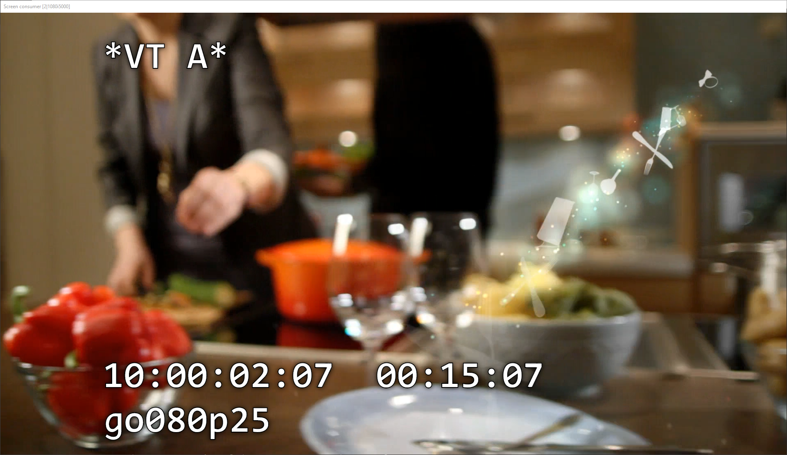

# CasparCG BITC Overlay

[](https://raw.githubusercontent.com/guildtv/ccg-bitc/master/LICENSE)

## Introduction

This is a simple timecode overlay for when using CasparCG as a simple VT player. The overlay is run on a second channel over a routed copy of the original clip and can be played out through a second decklink or screen consumer.

It reads some basic clip data over OSC (name, fps, time) and is compatible with CasparCG 2.0 and 2.1



## Configuration
### CasparCG
CasparCG needs to have at least 2 channels (one for playback, one for the overlayed output) and be set to output OSC to the local machine
```
<osc>
  <predefined-clients>
    <predefined-client>
      <address>127.0.0.1</address>
      <port>5253</port>
    </predefined-client>
  </predefined-clients>
</osc>
```

### BITC
Various configuration options are available. These should be specified when starting the program.

| Option | Default | Description |
|-|-|-|
| --http.port | 8081 | Port to serve the html overlay on |
| --osc.port | 5253 | Port to listen to OSC on |
| --caspar.host | 127.0.0.1 | IP address of caspar host|
| --caspar.port | 5250 | Port of caspar host |
| --source.channel | 1 | Channel of clip to monitor |
| --source.layer | 10 | Layer of clip to monitor |
| --output.channel | 2 | Channel to use for output with overlay |

